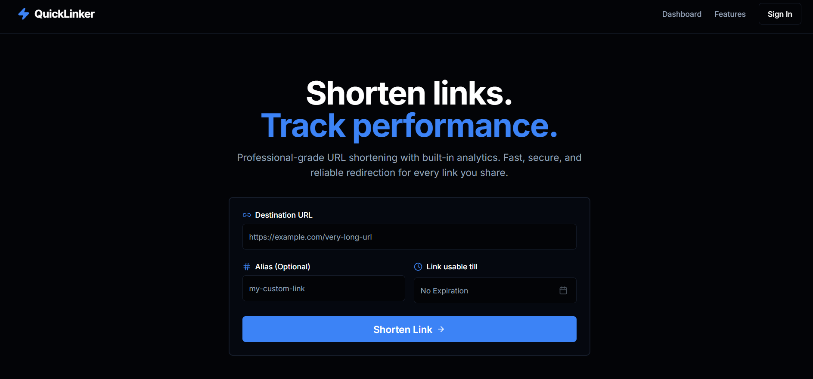

```markdown
# QuickLinker 🔗

[](https://opensource.org/licenses/MIT)
[](https://quicklinker.vercel.app)

QuickLinker is a professional URL shortener with built-in analytics. Create short, memorable links and track their performance in real time.



## Features

- URL Shortening – Convert long URLs into clean, shareable short links
- Custom Aliases – Create personalized links (e.g., `quick.link/your-brand`)
- Expiration Control – Set links to expire automatically on a specific date
- Click Analytics – Track total clicks and user engagement over time
- Performance Monitoring – View how users experience your links
- Instant Previews – Test changes before they go live
- Custom Domains – Use your own domain for branded links
- Responsive Dashboard – Manage all your links from one interface

## Tech Stack

- Framework: [Next.js](https://nextjs.org/) (App Router)
- Language: [TypeScript](https://www.typescriptlang.org/)
- Styling: [Tailwind CSS](https://tailwindcss.com/)
- Backend & Auth: [Firebase](https://firebase.google.com/) (Authentication, Firestore)
- Analytics: [Vercel Speed Insights](https://vercel.com/docs/analytics)
- Deployment: [Vercel](https://vercel.com/)

## Getting Started

### Prerequisites

- Node.js 18+ and npm
- Firebase project with Authentication and Firestore enabled

### Installation

1. Clone the repository
   ```bash
   git clone https://github.com/priyanshu8007b/QuickLinker.git
   cd QuickLinker
   ```

2. Install dependencies
   ```bash
   npm install
   ```

3. Set up Firebase
   - Go to [Firebase Console](https://console.firebase.google.com/)
   - Create a new project
   - Enable Google Sign-In in Authentication
   - Create a Firestore Database in test mode
   - Get your Firebase config from Project Settings → Your apps

4. Configure environment variables
   Create a `.env.local` file in the root directory:
   ```env
   NEXT_PUBLIC_FIREBASE_API_KEY=your_api_key
   NEXT_PUBLIC_FIREBASE_AUTH_DOMAIN=your_auth_domain
   NEXT_PUBLIC_FIREBASE_PROJECT_ID=your_project_id
   NEXT_PUBLIC_FIREBASE_STORAGE_BUCKET=your_storage_bucket
   NEXT_PUBLIC_FIREBASE_MESSAGING_SENDER_ID=your_messaging_sender_id
   NEXT_PUBLIC_FIREBASE_APP_ID=your_app_id
   ```

5. Run the development server
   ```bash
   npm run dev
   ```
   Open [http://localhost:3000](http://localhost:3000)

## Project Structure

```
QuickLinker/
├── public/             # Static assets
├── src/
│   ├── app/            # Next.js App Router
│   │   ├── page.tsx    # Home page (URL shortener form)
│   │   ├── dashboard/  # User dashboard with analytics
│   │   └── api/        # API routes for link redirection
│   ├── components/     # Reusable UI components
│   ├── lib/            # Firebase config, URL generation
│   └── types/          # TypeScript type definitions
├── firestore.rules     # Firestore security rules
├── next.config.ts      # Next.js configuration
├── tailwind.config.ts  # Tailwind CSS configuration
└── package.json
```

## How It Works

1. Paste a long URL – Enter any URL you want to shorten
2. Customize – Add a custom alias and set an expiration date (optional)
3. Generate – Get your short, shareable link instantly
4. Track – Monitor clicks and performance from your dashboard

## Security

- Firestore Rules – Users can only access their own links
- Authentication – Google Sign-In ensures data privacy
- No Expiration by Default – Links last forever unless you set an expiry

## Deployment

### Build for production
```bash
npm run build
```

### Deploy to Vercel
1. Push your code to GitHub
2. Import your repository at [Vercel](https://vercel.com)
3. Add the same environment variables from `.env.local`
4. Deploy – your app will be live in minutes

## Contributing

Contributions are welcome!

1. Fork the repository
2. Create your feature branch (`git checkout -b feature/AmazingFeature`)
3. Commit your changes (`git commit -m 'Add feature'`)
4. Push to the branch (`git push origin feature/AmazingFeature`)
5. Open a Pull Request

## License

Distributed under the MIT License. See `LICENSE` for more information.

## Contact

Priyanshu Prakash  
- GitHub: [@priyanshu8007b](https://github.com/priyanshu8007b)  
- Project Link: [https://github.com/priyanshu8007b/QuickLinker](https://github.com/priyanshu8007b/QuickLinker)  
- Live Demo: (https://quick-linker-navy.vercel.app/)

## Acknowledgments

- [Next.js Documentation](https://nextjs.org/docs)
- [Firebase Documentation](https://firebase.google.com/docs)
- [Tailwind CSS](https://tailwindcss.com/)
- [Vercel](https://vercel.com)
```
